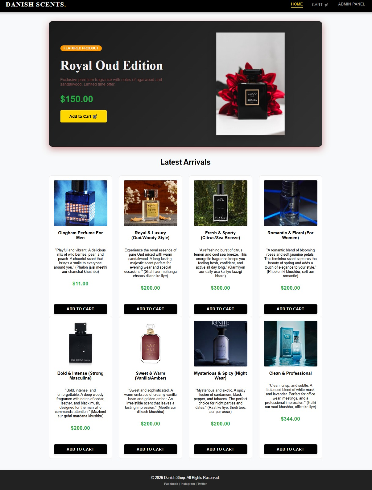
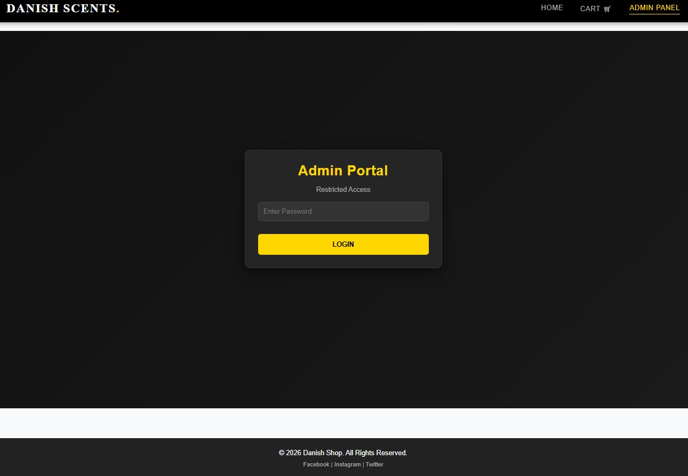
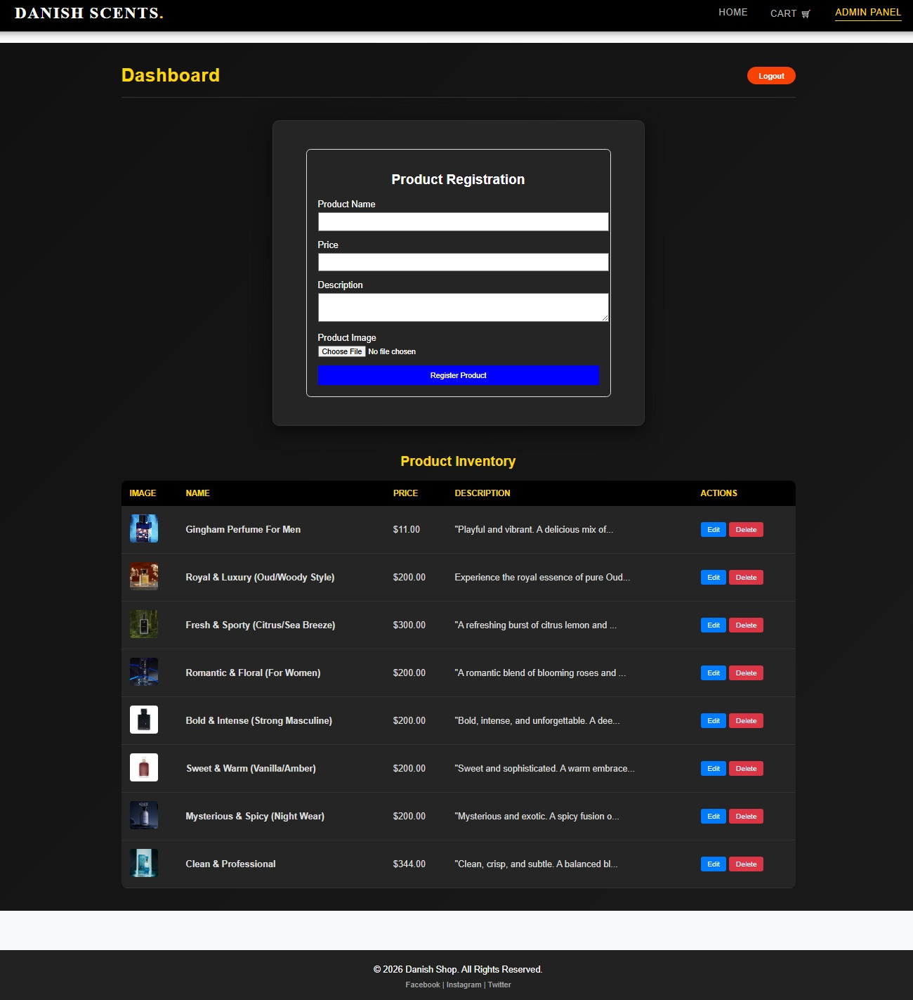
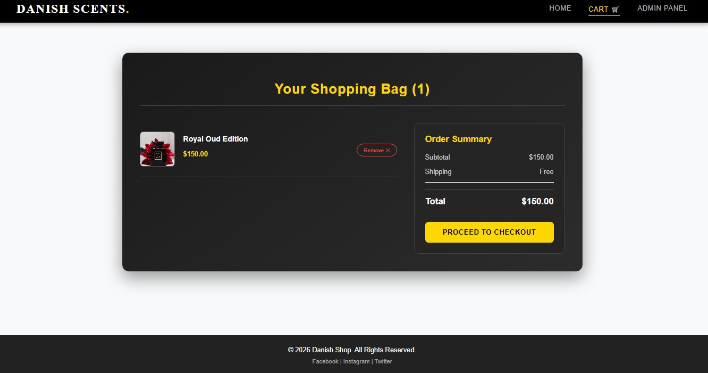
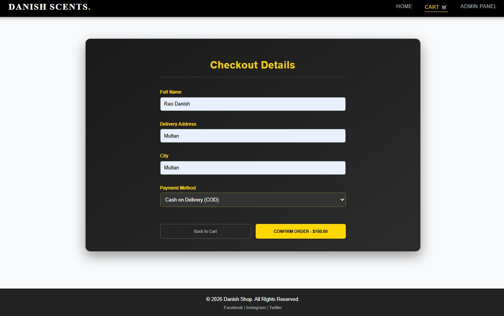

# 🌸 Danish Scents – Full Stack Perfume E-Commerce Website

A modern, responsive, and feature-rich *Perfume E-Commerce Web Application* built using *React.js, Node.js, Express.js, and PostgreSQL*. The application provides a complete online shopping experience with secure admin management, shopping cart, checkout system, and full product CRUD operations.

---

# ✨ Features

## 🏠 Customer Features
- Beautiful & Responsive Home Page
- Featured Products Section
- Latest Arrivals
- Product Details
- Add to Cart
- Remove from Cart
- Shopping Cart Summary
- Checkout Page
- Cash on Delivery (COD)
- Responsive User Interface

## 👨‍💼 Admin Features
- Secure Admin Login
- Admin Dashboard
- Product Registration
- Product Inventory Management
- Product Image Upload
- Edit Products
- Delete Products
- Complete CRUD Operations
- Product Search & Management

---

# 🛠️ Technologies Used

### Frontend
- React.js
- HTML5
- CSS3
- JavaScript (ES6)
- Axios

### Backend
- Node.js
- Express.js

### Database
- PostgreSQL

### Development Tools
- Visual Studio Code
- Git
- GitHub
- pgAdmin
- Postman

---

# ⚙️ CRUD Operations

✅ Create Product

✅ Read Products

✅ Update Product

✅ Delete Product

All product data is stored and managed using PostgreSQL through RESTful APIs.

---

# 📸 Project Screenshots

## 🏠 Home Page

## 🔐 Admin Login

## 📊 Admin Dashboard

## 🛒 Shopping Cart

## 💳 Checkout Page

---

# 📂 Project Structure

danish-scents/
│
├── product-client/
│   ├── public/
│   ├── src/
│   └── package.json
│
├── backend/
│   ├── index.js
│   ├── package.json
│   └── .gitignore
│
├── screenshots/
│   ├── home.png
│   ├── admin-login.png
│   ├── admin-dashboard.png
│   ├── cart.png
│   └── checkout.png
│
└── README.md

---

# 🚀 Installation

## Clone Repository

bash
git clone https://github.com/danishrao088-maker/danish-scents.git

## Install Frontend

bash
cd product-client
npm install
npm start

## Install Backend

bash
cd backend
npm install
npm start

---

# 🗄️ Database Configuration

Create a PostgreSQL database named:

productdb

Update your PostgreSQL credentials inside:

backend/index.js

Example:

javascript
user: "postgres",
host: "localhost",
database: "productdb",
password: "YOUR_PASSWORD",
port: 5432

---

# 🌟 Future Improvements

- User Authentication (Login & Signup)
- Wishlist
- Online Payment Gateway
- Order History
- Product Reviews & Ratings
- Email Notifications
- Sales Analytics Dashboard
- Product Categories & Filters

---

# 👨‍💻 Developer

*Danish Pervaiz*

🎓 BS Computer Science Student

💻 Full Stack Web Developer (React.js | Node.js | Express.js | PostgreSQL)

🌐 GitHub:
https://github.com/danishrao088-maker

---

# ⭐ Support

If you like this project, please consider giving it a *⭐ Star* on GitHub.

Your support is greatly appreciated!

---

## Thank You ❤️

Thank you for visiting *Danish Scents*.

Built with ❤️ using *React.js, Node.js, Express.js, and PostgreSQL*.
